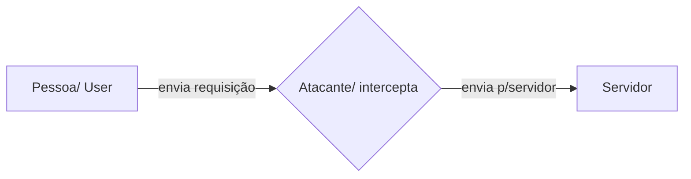

## HTTP - O que é:
HTTP é um protocolo de transferência que possibilita que as pessoas que inserem a URL do seu site na Web possam ver os conteúdos e dados que nele existem. A sigla vem do inglês Hypertext Transfer Protocol.

 * Hyper text
* Documento de marcação de hipertexto
* Características: está na camada de aplicação
* Baseado em requisição e resposta \ cliente : servidor
* Opera em TCP/IP .. Retorna

### Exemplo
#### Fluxo...
          1. Usuário informa a URL
          2 . Browser gera a requisição

          GET / HTTP / 1.1
          Host: [www.google.com.br
          (http://www.google.com.br)

          3. Servidor Web gera a resposta
             HTTP/1.1 200 Ok
             <html>...
          
          4. Browser exibe a página

  
## Metodos :   Suportados pelo HTTP

#### GET / PEGA INFORMAÇÕES
	-   Os parâmetros vão diretamente na URL
	-   Buscar dados do banco / Consumir dados
	-   Utilizado todas as vezes que estamos navegando em um site através de seus links, gerando pedidos e realizado com métodos GET
	    

> **Obs:** Como a requisição é feita através da URL existe uma limitação no tamanho da mensagem enviada.  A string não pode ultrapassar mais que 255 caracteres

#### POST / CRIA INFORMAÇÕES

	-   A requisição post só pode ser gerada através de um formulário web ou através de ajax, não sendo possível gerarmos um link POST
	-   Os parâmetros vão no corpo da requisição
	-   Post usado para consultar dados

#### PUT / 
	
	-   O método PUT substitui todas as atuais representações do recurso de destino pela carga de dados da requisição.
	-   Usado para alterar dados
	-   Atualizar dados
	- Consegue alterar objetos inteiros /substituição de valores

#### PATCH / EDITA INFORMAÇÃO

	-   O método patch é possível alterar apenas um dado
	-   O método de requisição HTTP PATCH aplica modificações parciais a um recurso.
    

#### DELETE / DELETA INFORMAÇÃO
	-   O método DELETE remove um recurso específico
    
#### TRACE /
	-   O método TRACE executa um teste de chamada loop-back junto com o caminho para o recurso de destino.
    
#### OPTIONS /
	-   Cliente saber qual verbo está sendo utilizado pela aplicação

#### CONNECT /

	-   O método CONNECT estabelece um túnel para o servidor identificado pelo recurso de destino.

#### HEAD /

	-   O método HEAD solicita uma resposta de forma idêntica ao método GET, porém sem conter o corpo da resposta.

## Diferença entre HTTP / HTTPS 

####  Https:
 O protocolo HTTPS (HyperText Transfer Protocol Secure) é idêntico ao HTTP e surgiu com o intuito de substituí-lo, porém, foi adicionada uma camada do SSL (Secure Sockets Layer) ou de TLS (Transfer Layer Security), o seu sucessor.
 

 - HTTPS - Navega pela porta 443 / Conexão encriptada
 
 - Utiliza certificado SSL certificate

 - Sistema de criptografia com duas chaves
 - Chave pública / Chave privada
 - A chave pública é conhecida por todos / A chave privada é conhecida
   apenas pelo destinatário

#### Http:
  HTTP -  Usuário navega pela porta 80 / Porta insegura (man in the middle)

  

### Porque o HTTP é inseguro?

O HTTP é inseguro, pois baseia-se apenas em texto, o que possibilita a invasores interceptarem, alterarem e roubarem as informações transferidas.

  

## Man in the middle?
O man-in-the-middle é uma forma de ataque em que os dados trocados entre duas partes são de alguma forma interceptados, registrados e, possivelmente, alterados pelo atacante sem que as vítimas se apercebem

##   O que é SSH ?
    
Terminal seguro / Secure SHell

	 - Permite que os usuários acessar os servidores de forma segura mesmo
	   dentro de uma rede insegura
	 - É um Protocolo de rede que utiliza criptografia para conectar duas
	   ponta
	 - Transferir dados comando e textos

Ele basicamente cria uma conexão entre dois pontos segura usando a criptografia

## Diferença entre criptografia assimétrica e simétrica?

  

### Criptografia Simétrica:
Utiliza uma chave única para cifrar e decifrar a mensagem. Nesse caso o segredo é compartilhado.
O ciframento de uma mensagem (processo em que um conteúdo é criptografado) é baseado em 2 componentes:

-   um algoritmo;
-   e uma chave de segurança.
    

O algoritmo trabalha junto com a chave, de forma que eles tornam um conteúdo sigiloso com um conjunto único de regras.

A criptografia simétrica faz uso de uma única chave, que é compartilhada entre o emissor e o destinatário de um conteúdo. Essa chave é uma cadeia própria de bits, que vai definir a forma como o algoritmo vai cifrar um conteúdo.

### Assimétrica:

A criptografia assimétrica, também conhecida como criptografia de chave pública, é baseada em 2 tipos de chaves de segurança, uma privada e a outra pública. Elas são usadas para cifrar mensagens e verificar a identidade de um usuário.

  

Resumidamente falando, a chave privada é usada para decifrar mensagens, enquanto a pública é utilizada para cifrar um conteúdo.

-   Não substitui a criptografia simétrica
    
-   Geralmente, criptografia assimétrica é usada para distribuir chaves simétricas;
    
-   A chave de criptografia utilizada para criptografar “Ch pub”, é diferente da chave de decriptografar , utilizando a “Ch priv”.
    
### Como a criptografia assimétrica pode ser usada como autenticação?

Para a autenticação do cliente, o servidor utiliza a chave pública do certificado do cliente para decriptografar os dados enviados pelo cliente

  
  

## Autenticação vs Autorização.

A autenticação e autorização são as medidas de segurança tomadas para proteger os dados no sistema de informação. Autenticação é o processo de verificação da identidade da pessoa que se aproxima do sistema. Por outro lado, Autorização é o processo de verificação dos privilégios ou lista de acesso para os quais a pessoa está autorizada.

#### Autenticação:
A autenticação é usada para verificar a identidade do usuário para permitir o acesso ao sistema. Por outro lado, a autorização determina quem deve poder acessar o que
Verifica a identidade da pessoa para conceder acesso ao sistema.

  

#### Autorização:

Verifica os privilégios ou permissões da pessoa para acessar os recursos.

  
  

-   Criar uma chave ssh ( com senha )
    
-   Colocar no GitHub
    
-   Criar dois repos
    
