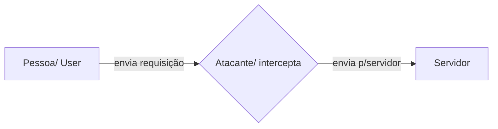

 

# <center>`MEUS ESTUDOS`

## HTTP - O que é:
HTTP é um protocolo de transferência que possibilita que as pessoas que inserem a URL do seu site na Web possam ver os conteúdos e dados que nele existem. A sigla vem do inglês Hypertext Transfer Protocol.

 * Hyper text
* Documento de marcação de hipertexto
* Características: está na camada de aplicação
* Baseado em requisição e resposta \ cliente : servidor
* Opera em TCP/IP .. Retorna

### Exemplo
#### Fluxo...
          1. Usuário informa a URL
          2 . Browser gera a requisição

          GET / HTTP / 1.1
          Host: [www.google.com.br
          (http://www.google.com.br)

          3. Servidor Web gera a resposta
             HTTP/1.1 200 Ok
             <html>...
          
          4. Browser exibe a página

  
## Metodos :   Suportados pelo HTTP

#### GET / PEGA INFORMAÇÕES
	-   Os parâmetros vão diretamente na URL
	-   Buscar dados do banco / Consumir dados
	-   Utilizado todas as vezes que estamos navegando em um site através de seus links, gerando pedidos e realizado com métodos GET
	    

> **Obs:** Como a requisição é feita através da URL existe uma limitação no tamanho da mensagem enviada.  A string não pode ultrapassar mais que 255 caracteres


#### POST / CRIA INFORMAÇÕES

	-   A requisição post só pode ser gerada através de um formulário web ou através de ajax, não sendo possível gerarmos um link POST
	-   Os parâmetros vão no corpo da requisição
	-   Post usado para consultar dados

#### PUT / 
	
	-   O método PUT substitui todas as atuais representações do recurso de destino pela carga de dados da requisição.
	-   Usado para alterar dados
	-   Atualizar dados
	- Consegue alterar objetos inteiros /substituição de valores

#### PATCH / EDITA INFORMAÇÃO

	-   O método patch é possível alterar apenas um dado
	-   O método de requisição HTTP PATCH aplica modificações parciais a um recurso.
    

#### DELETE / DELETA INFORMAÇÃO
	-   O método DELETE remove um recurso específico
    
#### TRACE /
	-   O método TRACE executa um teste de chamada loop-back junto com o caminho para o recurso de destino.
    
#### OPTIONS /
	-   Cliente saber qual verbo está sendo utilizado pela aplicação

#### CONNECT /

	-   O método CONNECT estabelece um túnel para o servidor identificado pelo recurso de destino.

#### HEAD /

	-   O método HEAD solicita uma resposta de forma idêntica ao método GET, porém sem conter o corpo da resposta.

## Diferença entre HTTP / HTTPS 

####  Https:
 O protocolo HTTPS (HyperText Transfer Protocol Secure) é idêntico ao HTTP e surgiu com o intuito de substituí-lo, porém, foi adicionada uma camada do SSL (Secure Sockets Layer) ou de TLS (Transfer Layer Security), o seu sucessor.
 

 - HTTPS - Navega pela porta 443 / Conexão encriptada
 
 - Utiliza certificado SSL certificate

 - Sistema de criptografia com duas chaves
 - Chave pública / Chave privada
 - A chave pública é conhecida por todos / A chave privada é conhecida
   apenas pelo destinatário

#### Http:
  HTTP -  Usuário navega pela porta 80 / Porta insegura (man in the middle)

  

### Porque o HTTP é inseguro?

O HTTP é inseguro, pois baseia-se apenas em texto, o que possibilita a invasores interceptarem, alterarem e roubarem as informações transferidas.

  

## Man in the middle?
O man-in-the-middle é uma forma de ataque em que os dados trocados entre duas partes são de alguma forma interceptados, registrados e, possivelmente, alterados pelo atacante sem que as vítimas se apercebem

##   O que é SSH ?
    
Terminal seguro / Secure SHell

	 - Permite que os usuários acessar os servidores de forma segura mesmo
	   dentro de uma rede insegura
	 - É um Protocolo de rede que utiliza criptografia para conectar duas
	   ponta
	 - Transferir dados comando e textos

Ele basicamente cria uma conexão entre dois pontos segura usando a criptografia


## Diferença entre criptografia assimétrica e simétrica?

  

### Criptografia Simétrica:
Utiliza uma chave única para cifrar e decifrar a mensagem. Nesse caso o segredo é compartilhado.
O ciframento de uma mensagem (processo em que um conteúdo é criptografado) é baseado em 2 componentes:

-   um algoritmo;
-   e uma chave de segurança.
    

O algoritmo trabalha junto com a chave, de forma que eles tornam um conteúdo sigiloso com um conjunto único de regras.

A criptografia simétrica faz uso de uma única chave, que é compartilhada entre o emissor e o destinatário de um conteúdo. Essa chave é uma cadeia própria de bits, que vai definir a forma como o algoritmo vai cifrar um conteúdo.

### Assimétrica:

A criptografia assimétrica, também conhecida como criptografia de chave pública, é baseada em 2 tipos de chaves de segurança, uma privada e a outra pública. Elas são usadas para cifrar mensagens e verificar a identidade de um usuário.

  

Resumidamente falando, a chave privada é usada para decifrar mensagens, enquanto a pública é utilizada para cifrar um conteúdo.

-   Não substitui a criptografia simétrica
    
-   Geralmente, criptografia assimétrica é usada para distribuir chaves simétricas;
    
-   A chave de criptografia utilizada para criptografar “Ch pub”, é diferente da chave de decriptografar , utilizando a “Ch priv”.
    
### Como a criptografia assimétrica pode ser usada como autenticação?

Para a autenticação do cliente, o servidor utiliza a chave pública do certificado do cliente para decriptografar os dados enviados pelo cliente

  
  

## Autenticação vs Autorização.

A autenticação e autorização são as medidas de segurança tomadas para proteger os dados no sistema de informação. Autenticação é o processo de verificação da identidade da pessoa que se aproxima do sistema. Por outro lado, Autorização é o processo de verificação dos privilégios ou lista de acesso para os quais a pessoa está autorizada.

#### Autenticação:
A autenticação é usada para verificar a identidade do usuário para permitir o acesso ao sistema. Por outro lado, a autorização determina quem deve poder acessar o que
Verifica a identidade da pessoa para conceder acesso ao sistema.

  

#### Autorização:

Verifica os privilégios ou permissões da pessoa para acessar os recursos.

  
  

-   Criar uma chave ssh ( com senha )
    
-   Colocar no GitHub
    
-   Criar dois repos
    

## Package.json:

O arquivo package.json é o ponto de partida de qualquer projeto NodeJS. Ele é responsável por descrever o seu projeto, informar as engines (versão do node e do npm), url do repositório, versão do projeto, dependências de produção e de desenvolvimento dentre outras coisas.

  

	-   Ele contém metadados sobre o seu projeto, como o título, o número de versão e as dependências.
	-   Ele também contém scripts que você pode utilizar para executar seu projeto.
	-   Um formato de representação de dados
	-   Utiliza o formato de chave e valor
	-   É leve para ser enviado por requisições
    
## Node_modules:

Module é uma coleção de funções e objetos do JavaScript que podem ser utilizados por aplicativos externos. Descrever um trecho de código como um módulo se refere menos ao que o código é do que aquilo que ele faz qualquer arquivo Node.js pode ser considerado um módulo caso suas funções e dados sejam feitos para programas externos.

-   Dividi o programa em várias partes (funções)
### O que é npm?
**npm** (gerenciador de pacotes do nó) é o gerenciador de dependências/pacotes que você obtém ao instalar o Node.js. Ele fornece uma maneira para os desenvolvedores instalarem pacotes globalmente e localmente.
### O que é npx?
O npx é pré-empacotado com o npm. Então é praticamente um padrão hoje em dia.
O npx também é uma ferramenta CLI cujo objetivo é facilitar a instalação e o gerenciamento de dependências hospedadas no registro npm.
### Diferença npm vs npx?
**npm** é o gerenciador de pacotes node, ele irá instalar na sua máquina um pacote para que você possa utiliza-lo em outros projetos sem precisar baixar novamente.

já o **npx** ele irá usar o pacote sem precisar baixar em sua máquina, sendo assim você irá instalar um pacote no seu projeto ou até mesmo usar esse pacote, sem baixar os arquivos em sua máquina.

## Merge VS REBESE 
Basicamente o **git merge** e o **git rebase** servem para a mesma coisa: **mesclar alterações de duas branches diferentes**.
#### Branches oq é?  


> Ramificação, em controle de versão e gerenciamento de configuração de software, é a duplicação de um objeto sob controle de versão.

O **merge**, na maioria das vezes, gera um novo commit, o que pode complicar o histórico, mas nunca o reescreve. (mas é mais seguro)

Já o **rebase** deixa o histórico linear e mais simples, mas alguns commits são reescritos, é muito útil para não “sujar” o histórico do repositório (mas possui mais riscos).


## Fast-Forward

Move o rótulo da branch master para o commit “feature". Por isso, o nome dessa estratégia é fast forward (em português avanço rápido), pois é simplesmente uma alteração de ponteiro.

## no-fast forward

O --no-ff sinalizador faz com que a mesclagem sempre crie um novo objeto de confirmação, mesmo que a mesclagem possa ser executada com um avanço rápido. Isso evita a perda de informações sobre a existência histórica de uma ramificação de recurso e agrupa todos os commits que juntos adicionaram o recurso.
A --no-ff opção é útil quando você deseja ter uma noção clara de sua ramificação de recurso. sem --no-ff, é impossível ver no histórico do Git quais dos objetos de confirmação juntos implementaram um recurso, você teria que ler manualmente todas.

  
  
  
  

## Rebese vs squash

**Merge Rebase:** Isso move todo o branch do recurso para começar na ponta do branch master, incorporando efetivamente todos os novos commits no master

Master A → B → C -->(F) → (G)

Feature A → B → C --> (D) → (E)

MASTER A → B → C → (F) → (G) → (D) → (E)

O **rebase** deixa o histórico linear e mais simples, mas alguns commits são reescritos, é muito útil para não “sujar” o histórico do repositório (mas possui mais riscos).

**Merge Squash:** mantém as alterações, mas omite os commits individuais do histórico

Master A → B → C

Feature A → B → C (D) → (E) |

MASTER A → B → C → (F)

  

## Git remote / qual é o remote do meu repositório ?

Um controle remoto no Git é um repositório comum que todos os membros da equipe usam para trocar suas alterações. Na maioria dos casos, esse repositório remoto é armazenado em um serviço de hospedagem de código como o GitHub ou em um servidor interno. Ao contrário de um repositório local, um remoto normalmente não fornece uma árvore de arquivos do estado atual do projeto.

origin git@github.com:Emanuel0001/sistema-de-usuario.git (fetch)

origin git@github.com:Emanuel0001/sistema-de-usuario.git (push)

  
  

## O que é uma aplicação distribuída?

Uma aplicação que executa simultaneamente em várias máquinas Um grupo de processos que executa em máquinas distintas e trabalha de forma coordenada e cooperativa para realizar uma determinada tarefa

São vários repositórios autônomos e independentes, um para cada desenvolvedor. Cada repositório possui uma área de trabalho acoplada e as operações commit e update acontecem localmente entre os dois.

  
  
  

## Arquivo de texto vs arquivos binarios

Nos arquivos **texto** os dados são representados linha à linha. Na prática é uma sequência de bytes representando caracteres. Assim, o conjunto de bytes forma um texto.

Já os arquivos **binários** são representados por uma sequência de bytes sem o conceito de quebra de linha. Ele armazena o dado literal, ou seja, não são caracteres.

**Na prática arquivos textos são abertos por editores de texto simples, enquanto que arquivos binários precisam ser abertos por programas específicos**
### Exemplo:

   #### Texto (qualquer arquivo que só armazene texto).txt, .xml, .bat
#### Binário (possuem uma codificação de bytes especifica) .doc, .exe, .zip 


## API# API, REST e RESTFUL

## API

Cliente (Client)
Garçom (pedidos, levar seus pedidos, para a cozinha) (API)
Cozinha (Server)

Acrônimo de Application Programming Interface (Interface de Programação de Aplicações) é basicamente um conjunto de rotinas e padrões estabelecidos por uma aplicação, para que outras aplicações possam utilizar as funcionalidades desta aplicação.

- Responsável por estabelecer comunicação entre diferentes serviços.
- Meio de campo entre as tecnologias.
- Intermediador para troca de informações.

## REST

um acrônimo para REpresentational State Transfer (Transferência de Estado Representativo).

Será feita a transferência de dados de uma maneira simbólica, figurativa, representativa, de maneira didática.

A transferência de dados, geralmente, usando o protocolo HTTP.

O REST delimita algumas obrigações nessas transferências de dados.

Resources seria então: Uma entidade ou um objeto.

### 6 NECESSIDADES (constraints) para ser RESTful

- _Uniform Interface_: Manter uma uniformidade, uma constância, um padrão na construção da interface. Nossa API precisa ser coerente para quem vai consumi-lá. Precisa fazer sentido para o cliente e não ser confusa. Logo, coisas como: o uso correto dos verbos HTTP; endpoints coerentes (todos os endpoints no plural, por exemplo); usar somente uma linguagem de comunicação (json) e não várias ao mesmo tempo; sempre enviar respostas aos clientes; são exemplos de aplicação de uma interface uniforme.

- _Client-server_: Separação do cliente e do armazenamento de dados (servidor), dessa forma, poderemos ter uma portabilidade do nosso sistema, usando o React para WEB e React Native para o smartphone, por exemplo.

- _Stateless_: Cada requisição que o cliente faz para o servidor, deverá conter todas as informações necessárias para o servidor entender e responder (RESPONSE) a requisição (REQUEST). Exemplo: A sessão do usuário deverá ser enviada em todas as requisições, para saber se aquele usuário está autenticado e apto a usar os serviços, e o servidor não pode lembrar que o cliente foi autenticado na requisição anterior. Nos nossos cursos, temos por padrão usar tokens para as comunicações.

- _Cacheable_: As respostas para uma requisição, deverão ser explicitas ao dizer se aquela resquição, pode ou não ser cacheada pelo cliente.

- _Layered System_: O cliente acessa a um endpoint, sem precisar saber da complexidade, de quais passos estão sendo necessários para o servidor responder a requisição, ou quais outras camadas o servidor estará lidando, para que a requisição seja respondida.

- _Code on demand (optional)_: Dá a possibilidade da nossa aplicação pegar códigos, como o javascript, por exemplo, e executar no cliente.

## RESTFUL

RESTful, é a aplicação dos padrões REST.

## BOAS PRÁTICAS

- Utilizar verbos HTTP para nossas requisições.
- Utilizar plural ou singular na criação dos endpoints? _NÃO IMPORTA!_ use um padrão!!
- Não deixar barra no final do endpoint
- Nunca deixe o cliente sem resposta!

### VERBOS HTTP

- GET: Receber dados de um Resource.
- POST: Enviar dados ou informações para serem processados por um Resource.
- PUT: Atualizar dados de um Resource.
- DELETE: Deletar um Resource

# STATUS DAS RESPOSTAS
## Respostas informativas

### 100 Continue

    Essa resposta provisória indica que tudo ocorreu bem até agora e que o cliente deve continuar com a requisição ou ignorar se já concluiu o que gostaria.
### 101 Switching Protocol

    Esse código é enviado em resposta a um cabeçalho de solicitação Upgrade (en-US) pelo cliente, e indica o protocolo a que o servidor está alternando.
###  102 Processing (en-US) (WebDAV (en-US))

    Este código indica que o servidor recebeu e está processando a requisição, mas nenhuma resposta está disponível ainda.
###  103 Early Hints

    Este código tem principalmente o objetivo de ser utilizado com o cabeçalho Link, indicando que o agente deve iniciar a pré-carregar (en-US) recursos enquanto o servidor prepara uma resposta.

### 200 OK

    Estas requisição foi bem sucedida. O significado do sucesso varia de acordo com o método HTTP:
### 201 Created

    A requisição foi bem sucedida e um novo recurso foi criado como resultado. Esta é uma tipica resposta enviada após uma requisição POST.
### 202 Accepted

    A requisição foi recebida mas nenhuma ação foi tomada sobre ela. Isto é uma requisição não-comprometedora, o que significa que não há nenhuma maneira no HTTP para enviar uma resposta assíncrona indicando o resultado do processamento da solicitação. Isto é indicado para casos onde outro processo ou servidor lida com a requisição, ou para processamento em lote.
### 203 Non-Authoritative Information

    Esse código de resposta significa que o conjunto de meta-informações retornadas não é o conjunto exato disponível no servidor de origem, mas coletado de uma cópia local ou de terceiros. Exceto essa condição, a resposta de 200 OK deve ser preferida em vez dessa resposta.
### 204 No Content

    Não há conteúdo para enviar para esta solicitação, mas os cabeçalhos podem ser úteis. O user-agent pode atualizar seus cabeçalhos em cache para este recurso com os novos.
### 205 Reset Content

    Esta requisição é enviada após realizanda a solicitação para informar ao user agent redefinir a visualização do documento que enviou essa solicitação.
### 206 Partial Content

    Esta resposta é usada por causa do cabeçalho de intervalo enviado pelo cliente para separar o download em vários fluxos.
### 207 Multi-Status (en-US) (WebDAV (en-US))

    Uma resposta Multi-Status transmite informações sobre vários recursos em situações em que vários códigos de status podem ser apropriados.
### 208 Multi-Status (en-US) (WebDAV (en-US))

    Usado dentro de um elemento de resposta <dav:propstat> para evitar enumerar os membros internos de várias ligações à mesma coleção repetidamente.
### 226 IM Used (en-US) (HTTP Delta encoding)

    O servidor cumpriu uma solicitação GET para o recurso e a resposta é uma representação do resultado de uma ou mais manipulações de instância aplicadas à instância atual.

## Mensagens de redirecionamento

### 300 Multiple Choice

    A requisição tem mais de uma resposta possível. User-agent ou o user deve escolher uma delas. Não há maneira padrão para escolher uma das respostas.
### 301 Moved Permanently

    Esse código de resposta significa que a URI do recurso requerido mudou. Provavelmente, a nova URI será especificada na resposta.
### 302 Found

    Esse código de resposta significa que a URI do recurso requerido foi mudada temporariamente. Novas mudanças na URI poderão ser feitas no futuro. Portanto, a mesma URI deve ser usada pelo cliente em requisições futuras.
### 303 See Other

    O servidor manda essa resposta para instruir ao cliente buscar o recurso requisitado em outra URI com uma requisição GET.
### 304 Not Modified

    Essa resposta é usada para questões de cache. Diz ao cliente que a resposta não foi modificada. Portanto, o cliente pode usar a mesma versão em cache da resposta.
### 305 Use Proxy Deprecated

    Foi definida em uma versão anterior da especificação HTTP para indicar que uma resposta deve ser acessada por um proxy. Foi depreciada por questões de segurança em respeito a configuração em banda de um proxy.
### 306 unused Deprecated

    Esse código de resposta não é mais utilizado, encontra-se reservado. Foi usado numa versão anterior da especificação HTTP 1.1.
### 307 Temporary Redirect

    O servidor mandou essa resposta direcionando o cliente a buscar o recurso requisitado em outra URI com o mesmo método que foi utilizado na requisição original. Tem a mesma semântica do código 302 Found, com a exceção de que o user-agent não deve mudar o método HTTP utilizado: se um POST foi utilizado na primeira requisição, um POST deve ser utilizado na segunda.
### 308 Permanent Redirect

    Esse código significa que o recurso agora está permanentemente localizado em outra URI, especificada pelo cabeçalho de resposta Location. Tem a mesma semântica do código de resposta HTTP 301 Moved Permanently com a exceção de que o user-agent não deve mudar o método HTTP utilizado: se um POST foi utilizado na primeira requisição, um POST deve ser utilizado na segunda.

# Respostas de erro do Cliente

### 400 Bad Request

    Essa resposta significa que o servidor não entendeu a requisição pois está com uma sintaxe inválida.
### 401 Unauthorized

    Embora o padrão HTTP especifique "unauthorized", semanticamente, essa resposta significa "unauthenticated". Ou seja, o cliente deve se autenticar para obter a resposta solicitada.
### 402 Payment Required Experimental

    Este código de resposta está reservado para uso futuro. O objetivo inicial da criação deste código era usá-lo para sistemas digitais de pagamento porém ele não está sendo usado atualmente.
### 403 Forbidden

    O cliente não tem direitos de acesso ao conteúdo portanto o servidor está rejeitando dar a resposta. Diferente do código 401, aqui a identidade do cliente é conhecida.
### 404 Not Found

    O servidor não pode encontrar o recurso solicitado. Este código de resposta talvez seja o mais famoso devido à frequência com que acontece na web.
### 405 Method Not Allowed

    O método de solicitação é conhecido pelo servidor, mas foi desativado e não pode ser usado.
### 406 Not Acceptable

    Essa resposta é enviada quando o servidor da Web após realizar a negociação de conteúdo orientada pelo servidor, não encontra nenhum conteúdo seguindo os critérios fornecidos pelo agente do usuário.
### 407 Proxy Authentication Required

    Semelhante ao 401 porem é necessário que a autenticação seja feita por um proxy.
### 408 Request Timeout

    Esta resposta é enviada por alguns servidores em uma conexão ociosa, mesmo sem qualquer requisição prévia pelo cliente. Ela significa que o servidor gostaria de derrubar esta conexão em desuso. Esta resposta é muito usada já que alguns navegadores, como Chrome, Firefox 27+, ou IE9, usam mecanismos HTTP de pré-conexão para acelerar a navegação. Note também que alguns servidores meramente derrubam a conexão sem enviar esta mensagem.
### 409 Conflict

    Esta resposta será enviada quando uma requisição conflitar com o estado atual do servidor.
### 410 Gone

    Esta resposta será enviada quando o conteúdo requisitado foi permanentemente deletado do servidor, sem nenhum endereço de redirecionamento. É experado que clientes removam seus caches e links para o recurso. A especificação HTTP espera que este código de status seja usado para "serviços promocionais de tempo limitado". APIs não devem se sentir obrigadas a indicar que recursos foram removidos com este código de status.
### 411 Length Required

    O servidor rejeitou a requisição porque o campo Content-Length do cabeçalho não está definido e o servidor o requer.
### 412 Precondition Failed

    O cliente indicou nos seus cabeçalhos pré-condições que o servidor não atende.
### 413 Payload Too Large

    A entidade requisição é maior do que os limites definidos pelo servidor; o servidor pode fechar a conexão ou retornar um campo de cabeçalho Retry-After.
### 414 URI Too Long

    A URI requisitada pelo cliente é maior do que o servidor aceita para interpretar.
### 415 Unsupported Media Type

    O formato de mídia dos dados requisitados não é suportado pelo servidor, então o servidor rejeita a requisição.
### 416 Requested Range Not Satisfiable

    O trecho especificado pelo campo Range do cabeçalho na requisição não pode ser preenchido; é possível que o trecho esteja fora do tamanho dos dados da URI alvo.
### 417 Expectation Failed

    Este código de resposta significa que a expectativa indicada pelo campo Expect do cabeçalho da requisição não pode ser satisfeita pelo servidor.
### 418 I'm a teapot

    O servidor recusa a tentativa de coar café num bule de chá.
### 421 Misdirected Request (en-US)

    A requisição foi direcionada a um servidor inapto a produzir a resposta. Pode ser enviado por um servidor que não está configurado para produzir respostas para a combinação de esquema ("scheme") e autoridade inclusas na URI da requisição.
### 422 Unprocessable Entity (WebDAV (en-US))

    A requisição está bem formada mas inabilitada para ser seguida devido a erros semânticos.
### 423 Locked (en-US) (WebDAV (en-US))

    O recurso sendo acessado está travado.
### 424 Failed Dependency (en-US) (WebDAV (en-US))

    A requisição falhou devido a falha em requisição prévia.
### 425 Too Early

    Indica que o servidor não está disposto a arriscar processar uma requisição que pode ser refeita.
### 426 Upgrade Required

    O servidor se recusa a executar a requisição usando o protocolo corrente mas estará pronto a fazê-lo após o cliente atualizar para um protocolo diferente. O servidor envia um cabeçalho Upgrade (en-US) numa resposta 426 para indicar o(s) protocolo(s) requeridos.
### 428 Precondition Required

    O servidor de origem requer que a resposta seja condicional. Feito para prevenir o problema da 'atualização perdida', onde um cliente pega o estado de um recurso (GET) , modifica-o, e o põe de volta no servidor (PUT), enquanto um terceiro modificou o estado no servidor, levando a um conflito.
### 429 Too Many Requests

    O usuário enviou muitas requisições num dado tempo ("limitação de frequência").
### 431 Request Header Fields Too Large

    O servidor não quer processar a requisição porque os campos de cabeçalho são muito grandes. A requisição PODE ser submetida novemente depois de reduzir o tamanho dos campos de cabeçalho.
### 451 Unavailable For Legal Reasons

    O usuário requisitou um recurso ilegal, tal como uma página censurada por um governo.

# Respostas de erro do Servidor

### 500 Internal Server Error

    O servidor encontrou uma situação com a qual não sabe lidar.
### 501 Not Implemented

    O método da requisição não é suportado pelo servidor e não pode ser manipulado. Os únicos métodos exigidos que servidores suportem (e portanto não devem retornar este código) são GET e HEAD.
### 502 Bad Gateway

    Esta resposta de erro significa que o servidor, ao trabalhar como um gateway a fim de obter uma resposta necessária para manipular a requisição, obteve uma resposta inválida.
### 503 Service Unavailable

    O servidor não está pronto para manipular a requisição. Causas comuns são um servidor em manutenção ou sobrecarregado. Note que junto a esta resposta, uma página amigável explicando o problema deveria ser enviada. Estas respostas devem ser usadas para condições temporárias e o cabeçalho HTTP Retry-After: deverá, se possível, conter o tempo estimado para recuperação do serviço. O webmaster deve também tomar cuidado com os cabeçalhos relacionados com o cache que são enviados com esta resposta, já que estas respostas de condições temporárias normalmente não deveriam ser postas em cache.
### 504 Gateway Timeout

    Esta resposta de erro é dada quando o servidor está atuando como um gateway e não obtém uma resposta a tempo.
### 505 HTTP Version Not Supported

    A versão HTTP usada na requisição não é suportada pelo servidor.
### 506 Variant Also Negotiates

    O servidor tem um erro de configuração interno: a negociação transparente de conteúdo para a requisição resulta em uma referência circular.
### 507 Insufficient Storage

    O servidor tem um erro interno de configuração: o recurso variante escolhido está configurado para entrar em negociação transparente de conteúdo com ele mesmo, e portanto não é uma ponta válida no processo de negociação.
### 508 Loop Detected (WebDAV (en-US))

    O servidor detectou um looping infinito ao processar a requisição.
### 510 Not Extended
    Exigem-se extensões posteriores à requisição para o servidor atendê-la.
### 511 Network Authentication Required

    O código de status 511 indica que o cliente precisa se autenticar para ganhar acesso à rede.


 ## React State

O estado ( state ) de um componente React tem uma função muito simples e específica. Ele é uma propriedade do componente onde colocamos dados que, quando mudados, devem causar uma nova renderização. Simples assim. Se deve causar mudança fica no estado, se não deve causar uma mudança, não fica.

-   State funciona como se fosse uma variável , sempre que modificado o conteúdo , os elementos que ele utiliza sofre alteração.
    
-   O state é um elemento privado, sendo assim, apenas terá acesso dentro do componente.
## O que é middleware e para que ele serve?

Middleware é um software que permite um ou mais tipos de comunicação ou conectividade entre dois ou mais aplicativos e/ou componentes de aplicativos em uma rede distribuída.

Com o middleware, os desenvolvedores podem criar aplicações com mais facilidade e eficiência, pois esse tipo de software tem o papel de conectar aplicações, dados e usuários.

Middleware é um software que fornece serviços e recursos comuns a aplicações. Gerenciamento de dados, serviços de aplicações, sistema de mensageria, autenticação e gerenciamento de APIs são recursos comumente operados por um software de middleware.

  

## O que é CORS?

CORS é o acrônimo de Cross-origin Resource Sharing (Compartilhamento de Recursos de Origem Cruzada). Na prática, ele informa aos navegadores se um determinado recurso pode ou não ser acessado.

  

Quando realizamos uma requisição a um servidor, os navegadores utilizam uma política de segurança chamada [same-origin](https://developer.mozilla.org/en-US/docs/Web/Security/Same-origin_policy) (ou mesma origem), que só autoriza a troca de informações se os envolvidos tiverem origens iguais…

Em resumo, a política same-origin exige que ambas as partes tenham a mesma origem para se comunicarem.

## O que é origem?

A origem de um website é uma composição envolvendo:

-   Protocolo;
    
-   Host;
    
-   Porta.
## Pesquisar sobre Cookies -  O que é?

Um cookie, no âmbito do protocolo de comunicação HTTP usado na Internet, é um pequeno arquivo de computador ou pacote de dados enviados por um site de Internet para o navegador do usuário, quando o utilizador visita o site. Cada vez que o usuário visita o site novamente, o navegador envia o cookie de volta para o servidor para notificar atividades prévias do usuário.

## Funcionamento

Quando o servidor deseja activar um cookie no cliente, envia uma linha no cabeçalho HTTP iniciada por Set-Cookie:A partir desse momento, consoante as opções especificadas pelo cookie, o cliente irá enviar no seu cabeçalho HTTP dos pedidos uma linha contendo os cookies relevantes, iniciada por Cookie: ....

## Quais os tipos de cookies?

Existem vários tipos de cookies. Enquanto alguns facilitam a sua vida, permitindo que você seja reconhecido mais rapidamente por sites, outros analisam o comportamento de navegação para gerar dados para serem utilizados como ferramentas de marketing por dados.

###  Cookies de sessão

Também chamado de cookie transitório, é apagado quando você fecha o navegador de internet. Ele é armazenado na memória temporária do computador e não é retido depois que o navegador é encerrado. Os cookies de sessão não coletam informações do seu computador. Eles normalmente armazenam informações na forma de uma identificação que não coleta dados pessoais do usuário.

###  Cookies persistentes

Também chamado de Cookie permanente, é armazenado em seu disco rígido até expirar (cookies persistentes são definidos com datas de expiração) ou até você excluir.

Os Cookies persistentes são usados para coletar informações de identificação sobre o usuário, como comportamento de navegação na internet ou preferências para um site específico.

## <center>TIPOS DE DISPLAY NO CSS


#### 16/05/2022


Display: Significa visualização, definir o tipo de visualização que o elemento vai ter na página, tipos block, inline, inline-block e none.

Valores mais tradicionais:
**Block:** 
>Ele ocupa todo espaço da pagina, tem quebra de linha.

**Inline:** 
>São dispostos da esquerda para direita ele sempre tem o tamanho suficiente para seu conteúdo, ignora largura e altura

**Inline-block:**
> Serve para ter elementos que podem ser definidos altura e largura, e que também pode estar um ao lado do outro, não tem quebra de linha.

**None:** 
>Não vai ser renderizado, O elemento não vai ser desenhado, não tem visualização e não vai ocupar espaço.


## <center>DISPLAY FLEX CSS


#### 17/05/2022


Display flex surgiu para resolver problemas com criação de telas flexíveis e responsivas, onde foi arquitetado uma nova ferramenta chamada Flexbox. Tem como objetivo ajudar o desenvolvedor a criar layouts robustos e flexíveis. Com ele podemos criar um sistema unidimensional , criando linhas e colunas baseados em um único eixo.
 

**Display: flex:**

 
> Faz com que os itens fiquem flexíveis

**Flex-direction: row:** 
 > Os itens são alinhados em linha

**Flex-direction: row-reverse:** 
> Em linhas porém os elementos são alinhados da direita para esquerda
  
**Flex-direction: column:** 
> Os elementos são aplicados em coluna.

**Flex-direction: column-reverse:** 
> Os elementos são aplicados em coluna porém de baixo para cima.

**Flex-wrap: wrap:** 
> faz com que a largura do elemento seja respeitada porém tem quebra de linha

  
**justify-content:**
> center; centraliza os itens.


**Justify-content: flex-start:** 
> Por padrão, define o alinhamento ao longo do eixo principal

**Justify-content; space-around:** 
> Vai respeitar a margem, vai distribuir a margem

## Async / await

#### 18/05/2022

Async e await, foram implementaas do ES2017, são sintaxe que simplifica a programação assíncrona, facilitando o fluxo de escrita, Eles trabalham com código baseado em Promises, Porém esconde as promessas para leitura fluída. Só é possível usar await quando declaramos async.

#### Exemplo:

		async function  getUser(userName) {

		let resposta = await  fetch(`https://api.com/api/user	
		/${userName}`);

		let userData = await resposta.json( );

	}

#### Diferenças entre then, async e await?

**Then:** vai executar uma função logo depois que sua tarefa terminar

**Async await:** vai dizer que sua tarefa é assíncrona e precisa de mais tempo para terminar

**Await:** vai dizer que você deve esperar a tarefa ser concluida para continuar

  
  

## Token de autenticação

#### 23/05/2022

Na autenticação por token, o usuário insere o login e senha na plataforma o que gera um token que permite que o usuario possa navegar pelos recursos do seu interesse, dentro de um prazo determinado, sem a necessidade de utilizar os dados do login novamente. A autenticação é um processo utilizado pelas plataformas para que possa ser confirmada a identidade do usuario, ela identifica quem solicita o acesso ao sistema, a fim de garantir que a pessoa está tentando entrar no servidor, é quem ela diz ser.

**O que é um token?**  Simplificando o token é uma sequência de dados que representa outra coisa, como uma identidade.

 #### Processos da autenticação por token:

		1.  O usuário envia as credenciais de acesso para o servidor;
    
		2.  O servidor faz a autenticação das credenciais e posteriormente gera um token;
    
		3.  A plataforma envia o token automaticamente para o usuário;
    
		4.  O usuário salva o token e o envia por meio de header (cabeçalho) sempre que fizer uma nova requisição;
    
		5.  A cada requisição, o servidor avalia se o token é válido ou não;
    
		6.  O servidor pode contar com um endpoint capaz de renovar o token.
		 
    

###  JSON Web Token

É um método padrão para realizar autenticação entre duas partes por meio de um token assinado que autentica uma requisição web. permite uma comunicação segura e protegida entre duas partes. Os dados são verificados com uma assinatura digital e, se forem enviados via HTTP, a criptografia mantém os dados seguros.

## Variáveis de Ambiente

#### 26/05/2022

No desenvolvimento de software, o que temos em comum são dados sensíveis, como informação do banco de dados, chaves de API’s, Secret Keys entre outras informações. Essas informações não podem ficar dando sopa por aí no repositório. Então para lidar com esse problema utilizamos variáveis de Ambiente.

### Dotenv

Dotenv é um módulo de dependência zero que carrega variáveis ​​de ambiente de um .env arquivo em process.env. O armazenamento da configuração no ambiente separado do código é baseado na metodologia The Twelve-Factor App .

**Como instalar?** 
			
				 npm install dotenv --save

**Uso:**
	 
		Crie um .env arquivo na raiz do seu projeto:

		CHAVE_NOME = " SUACHAVEAQUI "

**Como importar?**

		import 'dotenv/config'

		Const dotenv require('dotenv/config.js')

## Pesquisa Sobre Kanban

#### 02/06/2022

#### O que é Kanban?

O Kanban, uma palavra japonesa que significa cartões ou sinal, é conhecido como um método organizacional e de gestão visual que basicamente controla as tarefas de uma equipe. É um sistema ágil de gestão de produção ou de tarefas que funciona de maneira visual e dinâmica. Com ele, é possível organizar o fluxo de trabalho em colunas e cartões, de modo que toda a equipe visualize o fluxo do início ao fim, e identifique se há gargalos ou maneiras de otimizar o processo.

### Objetivo:

O kanban serve para melhorar a performance da sua empresa ou do seu trabalho priorizando a produtividade e a organização das entregas. Tem como objetivo proporcionar um trabalho mais transparente e direcionado.

### Funcionamento:

Normalmente o processo é dividido em 3 colunas, isso muda conforme as necessidades de cada projeto, adicionando mais colunas.

— **Para fazer** — — **Fazendo** — — **Feito** —

**Para fazer  :** Ficam as tarefas que precisam ser feitas

**Fazendo :** Ficam as tarefas que estão sendo feitas

**Feito :** Ficam as tarefas que já foram finalizadas.


## Seletores mais específicos e herança

```


<figure>
     
</figure>
```
Aplicando largura de 300px para todas as tags img
	

      img {
         width: 300px;
        }

 
 para aplicarmos de forma mais especifica aplicando apenas para tag filha :
   ``

    figure img {
        width: 300px;
        }
 
**CSS - Exemplo:**

```
#matriz-musicdot {
    width: 300px;
}

```
Não é recomendado uso de id para estilização de elementos ja que o atributo faz referência única, quando queremos estilizar elementos específicos é melhor utilizar class=" ". O comportamento é o mesmo no CSS, o class foi feito para ser usado no CSS e no javaScript.

**CSS - Exemplo:**

    .matriz-musicdot {
        width: 300px;}

### Grau de especificidade de um seletor
O grau de especificidade de um seletor é algo muito importante. É a prioridade de um seletor pelo navegador. para entender estas regras ao criar seletor de tag:  pontuação se torna **1**. Quando usamos um seletor de classe sua pontuação se torna **10**. Quando usamos um seletor de id sua pontuação se torna **100**. Ao fim, o navegador soma a pontuação dos seletores aplicados à um elemento, e as propriedades com o seletor de maior pontuação são as que valem.

```
<body>
    <p class="paragrafo" id="paragrafo-rosa">Texto</p>
</body>

p { /* Pontuação 1 */
    color: blue;
}

.paragrafo { /* Pontuação 10 */
    color: red;
}

#paragrafo-rosa { /* Pontuação 100 */
    color: pink;
}
```

No exemplo acima o parágrafo vai ficar com a cor rosa porque o seletor que tem a cor rosa é o seletor de maior pontuação.

### Herança

A cascata do CSS, significa justamente a possibilidade de elementos filhos herdarem características de estilização de elementos superiores.

 exemplo a seguir:

```
<body>
    <p>Uma breve explicação de algo com um <a href="https://google.com.br">link</a> para uma referência de outra página</p>
    <figure>
        
        <figcaption>Uma foto</figcaption>
    </figure>
</body>

```
 Uma maneira que podemos fazer é selecionar todas as tags que contém text (`<p>`, `<a>` e `<figcaption>`) e colocar a família de fonte que queremos:

```
p {
    font-family: 'Helvetica', sans-serif;
}

a {
    font-family: 'Helvetica', sans-serif;
}

figcaption {
    font-family: 'Helvetica', sans-serif;
}
```

Ao invés de colocar essa propriedade em cada um dos elementos, podemos colocar o elemento superior a estas tags, neste caso é o `<body>`.

```
body {
    font-family: 'Helvetica', sans-serif;
}
```
##  O valor inherit

Imagine a seguinte divisão com uma imagem:

**Exemplo:**

```
<div>
    
</div>
```

```
div {
    width: 30px;
    height: 30px;
}
```

Queremos que a imagem preencha todo o espaço da `<div>`, mas as propriedades `width` e `height` não são aplicadas em cascata, sendo assim, somos obrigados a definir o tamanho da imagem manualmente:

```
img {
    width: 30px;
    height: 30px;
}
```

Esta não é uma solução sustentável, porque, caso alterarmos o tamanho da `<div>`, teremos que lembrar de alterar também o tamanho da imagem. Uma forma de resolver este problema é utilizando o valor **inherit** para as propriedades `width` e `height` da imagem:

```
img {
    width: inherit;
    height: inherit;
}
```

O valor `inherit` indica para o elemento filho que ele deve utilizar o mesmo valor presente no elemento pai, sendo assim, toda vez que o tamanho do elemento pai for alterado, automaticamente o elemento filho herdará o novo valor, facilitando assim, a manutenção do código.
